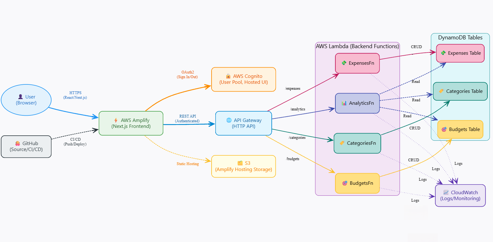

# NeoSpend – AWS-Powered Personal Finance Tracker
[](https://aws.amazon.com/lambda/) [](https://aws.amazon.com/dynamodb/) [](https://aws.amazon.com/cognito/) [](https://nextjs.org/) [](https://reactjs.org/) [](https://tailwindcss.com/) [](https://www.chartjs.org/) [](https://github.com/nishith-geedh/NeoSpend) [](LICENSE) [](https://github.com/nishith-geedh/NeoSpend/commits/main)

---

**NeoSpend** is a **modern, serverless personal finance tracker** built with **AWS serverless architecture** and **Next.js**. It provides comprehensive expense management, budget tracking, and analytics with a beautiful, responsive UI that works seamlessly across all devices.

---

## Table of Contents

- [✨ Features](#-features)
- [🏗️ Architecture](#️-architecture)
- [📂 Project Structure](#-project-structure)
- [🚀 Quick Start](#-quick-start)
- [🔧 Prerequisites](#-prerequisites)
- [📋 Backend Deployment (AWS SAM)](#-backend-deployment-aws-sam)
- [🎨 Frontend Setup](#-frontend-setup)
- [🌐 Production Deployment](#-production-deployment)
- [🔑 Environment Variables](#-environment-variables)
- [📊 API Endpoints](#-api-endpoints)
- [🎯 Key Features Deep Dive](#-key-features-deep-dive)
- [💡 Advanced Features](#-advanced-features)
- [🔒 Security & Authentication](#-security--authentication)
- [📈 Cost & Scalability](#-cost--scalability)
- [🛠️ Development & Testing](#️-development--testing)
- [🐛 Troubleshooting](#-troubleshooting)
- [🤝 Contributing](#-contributing)
- [📜 License](#-license)

---

## ✨ Features

### 🎨 **Modern UI/UX**
- **Responsive Design** with glass-morphism effects and gradient animations
- **Dark/Light Theme** support with system preference detection
- **Interactive Animations** with hover effects and smooth transitions
- **Mobile-First** approach with touch-friendly interfaces

### 💰 **Expense Management**
- **Smart Expense Tracking** with categories, dates, and descriptions
- **Real-time Currency** formatting in Indian Rupees (₹)
- **Advanced Filtering** by category, date range, and amount
- **Bulk Operations** with export functionality (JSON format)
- **Indian Date/Time** formatting for all timestamps

### 📊 **Budget Management**
- **Dynamic Budget Creation** with category-based limits
- **Real-time Progress Tracking** with visual progress bars
- **Smart Alerts** with threshold-based notifications
- **Budget Analytics** showing spent vs. allocated amounts
- **Persistent Notifications** until manually dismissed

### 📈 **Analytics & Insights**
- **Comprehensive Dashboard** with key financial metrics
- **Interactive Charts** using Chart.js (Bar, Line, Pie charts)
- **Multi-timeframe Analysis** (Daily, Weekly, Monthly, Annual)
- **Category Breakdown** with spending patterns
- **Trend Analysis** with month-over-month comparisons
- **Export Analytics** data in JSON format

### 🔐 **Security & Authentication**
- **AWS Cognito Integration** for secure user authentication
- **Multi-user Support** with isolated data per user
- **JWT Token Management** with automatic refresh
- **Secure API Endpoints** with proper authorization
- **Session Management** with NextAuth.js

### ☁️ **Serverless Architecture**
- **AWS Lambda** functions for backend logic
- **DynamoDB** for scalable data storage
- **API Gateway** for RESTful API endpoints
- **Auto-scaling** infrastructure with pay-per-use pricing
- **Zero Server Management** required

---

## 🏗️ Architecture

### **High-Level Architecture**

```
┌─────────────────┐    ┌──────────────────┐    ┌─────────────────┐
│   Next.js       │    │   AWS Cognito    │    │   DynamoDB      │
│   Frontend      │◄──►│   Authentication │    │   Data Store    │
│   (React)       │    │                  │    │                 │
└─────────────────┘    └──────────────────┘    └─────────────────┘
         │                       │                       ▲
         │                       │                       │
         ▼                       ▼                       │
┌─────────────────┐    ┌──────────────────┐              │
│   API Gateway   │    │   Lambda         │──────────────┘
│   (HTTP API)    │◄──►│   Functions      │
│                 │    │   (Node.js)      │
└─────────────────┘    └──────────────────┘
```


### **Detailed Component Architecture**

#### **Frontend Layer (Next.js)**
- **Pages**: Dashboard, Expenses, Budgets, Analytics, Landing
- **Components**: Reusable UI components with consistent theming
- **Authentication**: NextAuth.js with Cognito provider
- **State Management**: React hooks with local state
- **Styling**: Tailwind CSS with custom animations
- **Charts**: Chart.js with react-chartjs-2 wrapper

#### **API Layer (AWS API Gateway)**
- **HTTP API v2** with CORS enabled
- **JWT Authorization** via Cognito User Pool
- **RESTful Endpoints** for all CRUD operations
- **Rate Limiting** and request validation
- **Error Handling** with standardized responses

#### **Backend Layer (AWS Lambda)**
- **Expenses Function**: CRUD operations for expense management
- **Budgets Function**: Budget creation, tracking, and alerts
- **Categories Function**: Category management and organization
- **Analytics Function**: Data aggregation and insights generation
- **Event-driven Architecture** with API Gateway triggers

#### **Data Layer (Amazon DynamoDB)**
- **Expenses Table**: User expenses with GSI on userId, category, date
- **Budgets Table**: User budgets with GSI on userId, category
- **Categories Table**: User categories with GSI on userId, name
- **Pay-per-request** billing with auto-scaling
- **Global Secondary Indexes** for efficient querying

#### **Authentication Layer (Amazon Cognito)**
- **User Pool**: Secure user registration and authentication
- **User Pool Client**: Application-specific configuration
- **Hosted UI**: Customizable login/signup interface
- **JWT Tokens**: Secure session management
- **Multi-factor Authentication** support

---

## 📂 Project Structure

```
NeoSpend/
│
├── 📁 backend/                          # AWS SAM Backend
│   ├── 📄 template.yaml                 # SAM template for infrastructure
│   ├── 📄 samconfig.toml               # SAM deployment configuration
│   └── 📁 src/                         # Lambda function source code
│       ├── 📁 expenses/                # Expense management Lambda
│       │   ├── 📄 index.js            # Main handler function
│       │   └── 📄 package.json        # Dependencies
│       ├── 📁 budgets/                 # Budget management Lambda
│       │   ├── 📄 index.js            # Main handler function
│       │   └── 📄 package.json        # Dependencies
│       ├── 📁 categories/              # Category management Lambda
│       │   ├── 📄 index.js            # Main handler function
│       │   └── 📄 package.json        # Dependencies
│       └── 📁 analytics/               # Analytics Lambda
│           ├── 📄 index.js            # Main handler function
│           └── 📄 package.json        # Dependencies
│
├── 📁 frontend/                         # Next.js Frontend
│   ├── 📄 package.json                 # Frontend dependencies
│   ├── 📄 next.config.mjs              # Next.js configuration
│   ├── 📄 tailwind.config.js           # Tailwind CSS configuration
│   ├── 📄 .env.local                   # Environment variables
│   ├── 📁 app/                         # Next.js 13+ App Router
│   │   ├── 📄 layout.js                # Root layout component
│   │   ├── 📄 page.js                  # Landing page
│   │   ├── 📄 globals.css              # Global styles and animations
│   │   ├── 📁 dashboard/               # Dashboard page
│   │   │   └── 📄 page.js             # Dashboard component
│   │   ├── 📁 expenses/                # Expenses management page
│   │   │   └── 📄 page.js             # Expenses component
│   │   ├── 📁 budgets/                 # Budget management page
│   │   │   └── 📄 page.js             # Budgets component
│   │   ├── 📁 analytics/               # Analytics page
│   │   │   └── 📄 page.js             # Analytics component
│   │   ├── 📁 login/                   # Login page
│   │   │   └── 📄 page.js             # Login component
│   │   ├── 📁 api/                     # API routes
│   │   │   └── 📁 auth/               # NextAuth.js configuration
│   │   │       └── 📁 [...nextauth]/  # Dynamic auth routes
│   │   │           └── 📄 route.js    # Auth configuration
│   │   └── 📁 components/              # Reusable components
│   │       └── 📄 Header.js           # Navigation header
│   └── 📁 lib/                         # Utility libraries
│       └── 📄 api.js                   # API client with authentication
│
├── 📄 README.md                        # This file
├── 📄 DEPLOYMENT_GUIDE.md              # Deployment instructions
└── 📄 .gitignore                       # Git ignore rules
```

---

## 🚀 Quick Start

### 🔧 Prerequisites

- **AWS Account** with appropriate permissions
- **Node.js** 18.x or later
- **AWS CLI** configured with credentials
- **AWS SAM CLI** for backend deployment
- **Git** for version control

### 📋 Backend Deployment (AWS SAM)

1. **Clone the repository**
   ```bash
   git clone https://github.com/nishith-geedh/NeoSpend.git
   cd NeoSpend
   ```

2. **Deploy backend infrastructure**
   ```bash
   cd backend
   sam build
   sam deploy --guided
   ```

3. **Configure deployment parameters**
   ```
   Stack Name: neospend-backend
   AWS Region: ap-south-1 (or your preferred region)
   Parameter Environment: prod
   Confirm changes before deploy: Y
   Allow SAM CLI IAM role creation: Y
   Save parameters to configuration file: Y
   ```

4. **Note the deployment outputs**
   - API Gateway URL
   - Cognito User Pool ID
   - Cognito User Pool Client ID
   - Cognito Domain

### 🎨 Frontend Setup

1. **Install dependencies**
   ```bash
   cd frontend
   npm install
   ```

2. **Configure environment variables**
   Create `frontend/.env.local`:
   ```env
   # AWS Cognito Configuration
   NEXTAUTH_URL=http://localhost:3000
   NEXTAUTH_SECRET=your-nextauth-secret-here
   
   # AWS Cognito User Pool (From backend deployment)
   COGNITO_CLIENT_ID=your-cognito-client-id
   COGNITO_CLIENT_SECRET=your-cognito-client-secret
   COGNITO_ISSUER=https://cognito-idp.ap-south-1.amazonaws.com/your-user-pool-id
   COGNITO_USER_POOL_ID=your-user-pool-id
   
   # API Gateway URL (From backend deployment)
   NEXT_PUBLIC_API_BASE_URL=https://your-api-gateway-url.execute-api.ap-south-1.amazonaws.com/prod
   ```

3. **Start development server**
   ```bash
   npm run dev
   ```

4. **Access the application**
   - **Development**: [http://localhost:3000](http://localhost:3000)
   - **Production**: [https://main.d11rdxozwhcrfu.amplifyapp.com](https://main.d11rdxozwhcrfu.amplifyapp.com)

### 🌐 Production Deployment

#### **Option 1: AWS Amplify (Recommended)**

1. **Connect GitHub repository** to AWS Amplify
2. **Configure build settings**:
   ```yaml
   version: 1
   frontend:
     phases:
       preBuild:
         commands:
           - cd frontend
           - npm install
       build:
         commands:
           - npm run build
     artifacts:
       baseDirectory: frontend/.next
       files:
         - '**/*'
     cache:
       paths:
         - frontend/node_modules/**/*
   ```

3. **Set environment variables** in Amplify console
4. **Deploy** and get your production URL

#### **Option 2: Vercel**

1. **Connect repository** to Vercel
2. **Set build command**: `cd frontend && npm run build`
3. **Set output directory**: `frontend/.next`
4. **Configure environment variables**
5. **Deploy**

---

## 🔑 Environment Variables

### **Frontend (.env.local)**
```env
# NextAuth.js Configuration
NEXTAUTH_URL=http://localhost:3000
NEXTAUTH_SECRET=your-secret-key-here

# AWS Cognito Configuration
COGNITO_CLIENT_ID=your-cognito-client-id
COGNITO_CLIENT_SECRET=your-cognito-client-secret
COGNITO_ISSUER=https://cognito-idp.region.amazonaws.com/user-pool-id
COGNITO_USER_POOL_ID=your-user-pool-id

# API Configuration
NEXT_PUBLIC_API_BASE_URL=https://your-api-gateway-url.execute-api.region.amazonaws.com/prod
```

### **Backend (SAM Template)**
```yaml
Environment:
  EXPENSES_TABLE_NAME: NeoSpend-Expenses
  BUDGETS_TABLE_NAME: NeoSpend-Budgets
  CATEGORIES_TABLE_NAME: NeoSpend-Categories
```

---

## 📊 API Endpoints

### **Authentication**
All endpoints require JWT token in Authorization header:
```
Authorization: Bearer <jwt-token>
```

### **Expenses API**
```
GET    /expenses          # Get user expenses
POST   /expenses          # Create new expense
PUT    /expenses/{id}     # Update expense
DELETE /expenses/{id}     # Delete expense
```

### **Budgets API**
```
GET    /budgets           # Get user budgets
POST   /budgets           # Create new budget
PUT    /budgets/{id}      # Update budget
DELETE /budgets/{id}      # Delete budget
```

### **Categories API**
```
GET    /categories        # Get user categories
POST   /categories        # Create new category
PUT    /categories/{id}   # Update category
DELETE /categories/{id}   # Delete category
```

### **Analytics API**
```
GET    /analytics         # Get analytics data
```

---

## 🎯 Key Features Deep Dive

### **💰 Expense Management**
- **Smart Categorization**: Automatic category suggestions based on spending patterns
- **Date Range Filtering**: Filter expenses by custom date ranges
- **Amount-based Search**: Find expenses within specific amount ranges
- **Export Functionality**: Download expenses in JSON format with Indian date formatting
- **Real-time Updates**: Instant UI updates when adding/editing expenses

### **📊 Budget Management**
- **Category-based Budgets**: Set spending limits for specific categories
- **Progress Tracking**: Visual progress bars showing budget utilization
- **Alert System**: Notifications when budgets exceed threshold percentages
- **Dynamic Calculations**: Real-time budget vs. actual spending comparisons
- **Persistent Notifications**: Alerts remain visible until manually dismissed

### **📈 Analytics Dashboard**
- **Multi-timeframe Analysis**: Daily, weekly, monthly, and annual views
- **Interactive Charts**: Bar charts, line charts, and pie charts using Chart.js
- **Category Breakdown**: Visual representation of spending by category
- **Trend Analysis**: Month-over-month spending comparisons
- **Export Capability**: Download analytics data for external analysis

### **🎨 Modern UI/UX**
- **Glass-morphism Design**: Modern, translucent UI elements
- **Gradient Animations**: Smooth color transitions and hover effects
- **Responsive Layout**: Optimized for desktop, tablet, and mobile
- **Dark/Light Themes**: Automatic theme detection with manual override
- **Smooth Animations**: Micro-interactions for enhanced user experience

---

## 💡 Advanced Features

### **🔔 Smart Notifications**
- **Budget Alerts**: Real-time notifications when budgets are exceeded
- **Threshold Warnings**: Customizable alert percentages
- **Persistent Display**: Notifications stay visible until dismissed
- **Visual Indicators**: Red gradient styling with exclamation icons

### **📱 Mobile Optimization**
- **Touch-friendly Interface**: Optimized for mobile interactions
- **Responsive Charts**: Charts adapt to screen size
- **Mobile Navigation**: Collapsible navigation for small screens
- **Gesture Support**: Swipe and touch gestures for better UX

### **🌍 Internationalization**
- **Indian Currency**: All amounts displayed in Rupees (₹)
- **Indian Date Format**: DD/MM/YYYY format throughout the application
- **Indian Timezone**: Asia/Kolkata timezone for all timestamps
- **Localized Formatting**: Number formatting for Indian locale

### **📊 Data Export**
- **JSON Export**: Structured data export for expenses and analytics
- **Indian Timestamps**: All exported data includes Indian timezone timestamps
- **User Privacy**: User IDs removed from exported data
- **Comprehensive Data**: Includes metadata like download timestamp and totals

---

## 🔒 Security & Authentication

### **AWS Cognito Integration**
- **Secure User Pool**: Enterprise-grade user authentication
- **JWT Tokens**: Stateless authentication with automatic refresh
- **Multi-factor Authentication**: Optional MFA support
- **Password Policies**: Enforced strong password requirements

### **API Security**
- **JWT Authorization**: All API endpoints protected with JWT tokens
- **CORS Configuration**: Proper cross-origin resource sharing setup
- **Input Validation**: Server-side validation for all inputs
- **Error Handling**: Secure error messages without sensitive data exposure

### **Data Protection**
- **User Isolation**: Each user's data is completely isolated
- **Encryption at Rest**: DynamoDB encryption for stored data
- **Encryption in Transit**: HTTPS for all communications
- **Least Privilege**: IAM roles with minimal required permissions

---

## 📈 Cost & Scalability

### **AWS Service Costs (Estimated)**
| Service | Purpose | Cost (per month) | Scalability |
|---------|---------|------------------|-------------|
| **DynamoDB** | Data storage | $0.25 per million reads/writes | Auto-scaling |
| **Lambda** | Backend functions | $0.20 per million requests | Scales to zero |
| **API Gateway** | API endpoints | $1.00 per million requests | Auto-scaling |
| **Cognito** | Authentication | $0.0055 per MAU | Auto-scaling |
| **Amplify** | Frontend hosting | $0.15 per GB served | Global CDN |

### **Scaling Characteristics**
- **Automatic Scaling**: All services scale automatically with demand
- **Pay-per-use**: Only pay for actual usage, no idle costs
- **Global Availability**: Multi-region deployment support
- **High Availability**: 99.99% uptime SLA for AWS services

---

## 🛠️ Development & Testing

### **Local Development**
```bash
# Start frontend development server
cd frontend
npm run dev

# Run linting
npm run lint

# Build for production
npm run build
```

### **Backend Testing**
```bash
# Test Lambda functions locally
cd backend
sam local start-api

# Test specific function
sam local invoke ExpensesFn --event test-payload.json
```

### **API Testing**
```bash
# Test expenses endpoint
curl -X GET https://your-api-url/expenses \
  -H "Authorization: Bearer your-jwt-token"

# Test budget creation
curl -X POST https://your-api-url/budgets \
  -H "Authorization: Bearer your-jwt-token" \
  -H "Content-Type: application/json" \
  -d '{"category": "Food", "amount": 5000, "period": "monthly"}'
```

---

## 🐛 Troubleshooting

### **Common Issues**

#### **Authentication Errors**
- **Issue**: `invalid_client` error during login
- **Solution**: Verify `COGNITO_CLIENT_ID` and `COGNITO_CLIENT_SECRET` in `.env.local`

#### **API Connection Issues**
- **Issue**: 401 Unauthorized errors
- **Solution**: Check JWT token validity and API Gateway URL configuration

#### **Build Errors**
- **Issue**: `ChunkLoadError` during development
- **Solution**: Delete `.next` folder and restart development server

#### **DynamoDB Permissions**
- **Issue**: 500 Internal Server Error
- **Solution**: Verify Lambda functions have proper DynamoDB permissions

### **Debug Mode**
Enable debug logging by setting:
```env
NODE_ENV=development
```

### **CloudWatch Logs**
Monitor Lambda function execution:
```bash
aws logs describe-log-groups --log-group-name-prefix /aws/lambda/NeoSpend
```

---

## 🤝 Contributing

We welcome contributions! Please follow these steps:

1. **Fork the repository**
2. **Create a feature branch**: `git checkout -b feature/amazing-feature`
3. **Commit your changes**: `git commit -m 'Add amazing feature'`
4. **Push to the branch**: `git push origin feature/amazing-feature`
5. **Open a Pull Request**

### **Development Guidelines**
- Follow existing code style and patterns
- Add tests for new features
- Update documentation as needed
- Ensure all tests pass before submitting PR

---

## 📜 License

This project is licensed under the MIT License - see the [LICENSE](LICENSE) file for details.

---

## 🎉 Acknowledgments

- **AWS** for providing excellent serverless services
- **Next.js** team for the amazing React framework
- **Tailwind CSS** for the utility-first CSS framework
- **Chart.js** for beautiful data visualizations
- **React Icons** for the comprehensive icon library

---

**NeoSpend** – *Take control of your finances with modern, serverless technology* 🚀

---

<div align="center">
  <p>Built with ❤️ using AWS Serverless Architecture</p>
  <p>
    <a href="#neospend--aws-powered-personal-finance-tracker">⬆️ Back to Top</a>
  </p>
</div>
